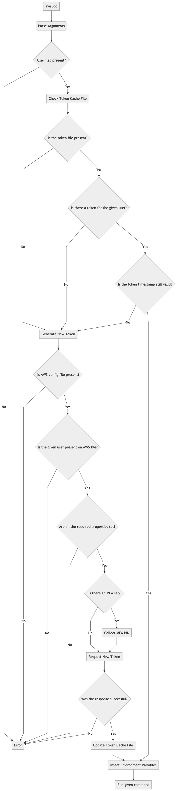

<p align="center">
  
  <p align="center">sudo-like behavior for role assumed access on AWS accounts</p>
  <p align="center">
    
  </p>
</p>

## What does it do?

The AWS sudo, inject aws credentials to the command you want to run:

```shell
awsudo -u staging env | grep AWS
```

Results in:
```shell
AWS_SESSION_TOKEN=********
AWS_SECRET_ACCESS_KEY=**************
AWS_ACCESS_KEY_ID=********
```

**Notice** - `awsudo` was meant for local usage, it is not for server authentication.

See the [Motivation](#motivation) section for more info.

### Workflow

This is how the CLI works under the hood:

(click to see the large version)



## Setup

It is assumed that you have `awscli` installed and configured OR at least, the `~/.aws/config` file following this pattern:

```
[profile]
role_arn=...
mfa_serial=... (if necessary)
region=...
```

### macOS

```shell
brew tap marceloboeira/formulas
brew install marceloboeira/formulas/awsudo
```

## Usage

```
awsudo - sudo-like behavior for role assumed access on AWS accounts 0.1.0

USAGE:
    awsudo [OPTIONS] --user <user> [SUBCOMMAND]

FLAGS:
    -h, --help       Prints help information
    -V, --version    Prints version information

OPTIONS:
        --cache-dir <DIR>    Custom directory for credentials caching, defaults to ~/.awsudo/
    -c, --config <FILE>      Custom config file, defaults to: ~/.aws/config
    -u, --user <user>        AWS profile name based on the config file
```

Thanks [clap](https://github.com/clap-rs/clap) for that.

### Examples

Get all of the S3 buckets of the **production** account:

```shell
awsudo -u production aws s3 ls
```

Run a executable that needs AWS credentials:

```shell
awsudo -u staging delete_s3_buckets "s3://staging-acc/foo"
```

#### Aliases

This is not required, but interesting:

```shell
alias awss='awsudo -u staging'
alias awso='awsudo -u operations'
alias awsp='awsudo -u production'
```

Then after:

```shell
awss [subcomand]
```

# Motivation

Main motivation was to write something that I would use everyday with rust, the awsudo usecase was quite interesting. The [original awsudo](https://github.com/makethunder/awsudo/) is heavily used where I work and it constantly causes pain, the CLI has a couple of issues:

1. **Distribution** - It was written in Python, which makes it difficult to distribute, also doens't have a homebrew formula
1. **Dependencies** - It [locks the aws-cli version](https://github.com/makethunder/awsudo/issues/7), and [depends on code of the CLI itself](https://github.com/makethunder/awsudo/blob/d5800bc4a9785d179c678605d0ae5bf4e28f5205/awsudo/config.py#L1)
1. **Versioning** - It [doesn't have versions whatsoever](https://github.com/makethunder/awsudo/releases)
1. **Bugs** - It has a couple of bugs, e.g.: [you can't pass `AWS_*` like variables to your command](https://github.com/makethunder/awsudo/issues/14)

The [official solution](https://docs.aws.amazon.com/cli/latest/userguide/cli-roles.html#cli-roles-cache) from AWS is not really great either:
1. Stateful - Once you assume you stick with it until it expires or you switch
1. CLI centric - Hard to share the credentials and switch quickly if you are not using their CLI
